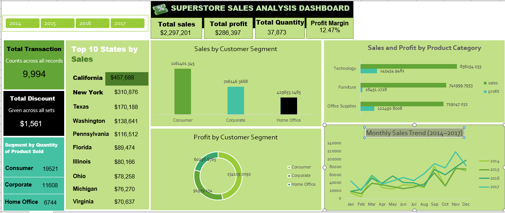

# Superstore Sales Dashboard

## Project Overview

This project presents an interactive Microsoft Excel dashboard developed to analyse the sales and profitability performance of a retail Superstore.

The dashboard transforms transactional sales data into clear business insights by examining sales performance across customer segments, product categories, and time periods.

## Business Objective

The objective of this project was to analyse Superstore sales data and develop an interactive dashboard that enables management to monitor key performance indicators, identify major revenue and profit drivers, and understand sales patterns across different business segments.

## Key Performance Indicators

- Total Sales: **$2.30M**
- Total Profit: **$286.40K**
- Profit Margin: **12.47%**
- Total Quantity Sold: **37,873**
- Total Transactions: **9,994**

## Key Insights

- The **Consumer segment** generated the highest overall sales, contributing approximately **$1.16 million**.
- The **Technology category** recorded the highest sales among the three major product categories, generating approximately **$836,000** in revenue.
- Technology was also the most profitable category, generating approximately **$145,000** in profit.
- California emerged as one of the strongest-performing states in terms of overall sales.
- Sales performance generally increased across the four-year analysis period.
- The overall profit margin was approximately **12.47%**.

## Dashboard Features

The dashboard includes:

- Total Sales KPI
- Total Profit KPI
- Profit Margin KPI
- Quantity Sold KPI
- Sales by Customer Segment
- Profit by Customer Segment
- Sales and Profit by Product Category
- Monthly Sales Trend
- Interactive business performance analysis

## Tools Used

- Microsoft Excel
- PivotTables
- PivotCharts
- Excel Formulas
- Data Cleaning
- Data Aggregation
- KPI Development
- Dashboard Design
- Data Visualisation

## Skills Demonstrated

This project demonstrates my ability to:

- Clean and organise transactional data
- Perform exploratory data analysis
- Develop business KPIs
- Analyse sales and profitability
- Build PivotTables and PivotCharts
- Design interactive Excel dashboards
- Translate raw data into actionable business insights
- Communicate analytical findings visually

## Project File

- `Superstore_Sales_Dashboard.xlsx` – Interactive Excel dashboard

## Author

**Sikiru Olafare**

Data Analyst | Excel | SQL | Power BI | Python | Data Visualisation
